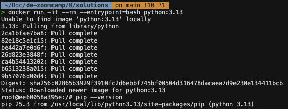
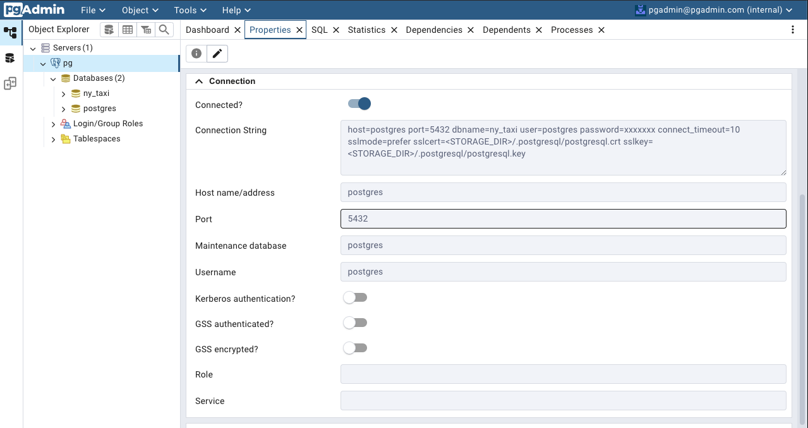
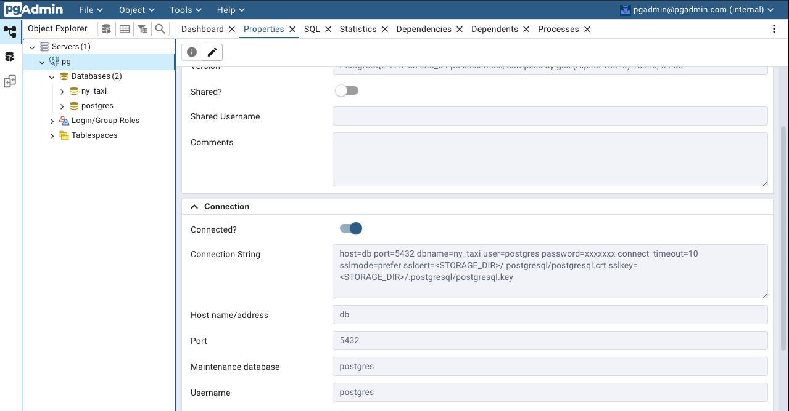
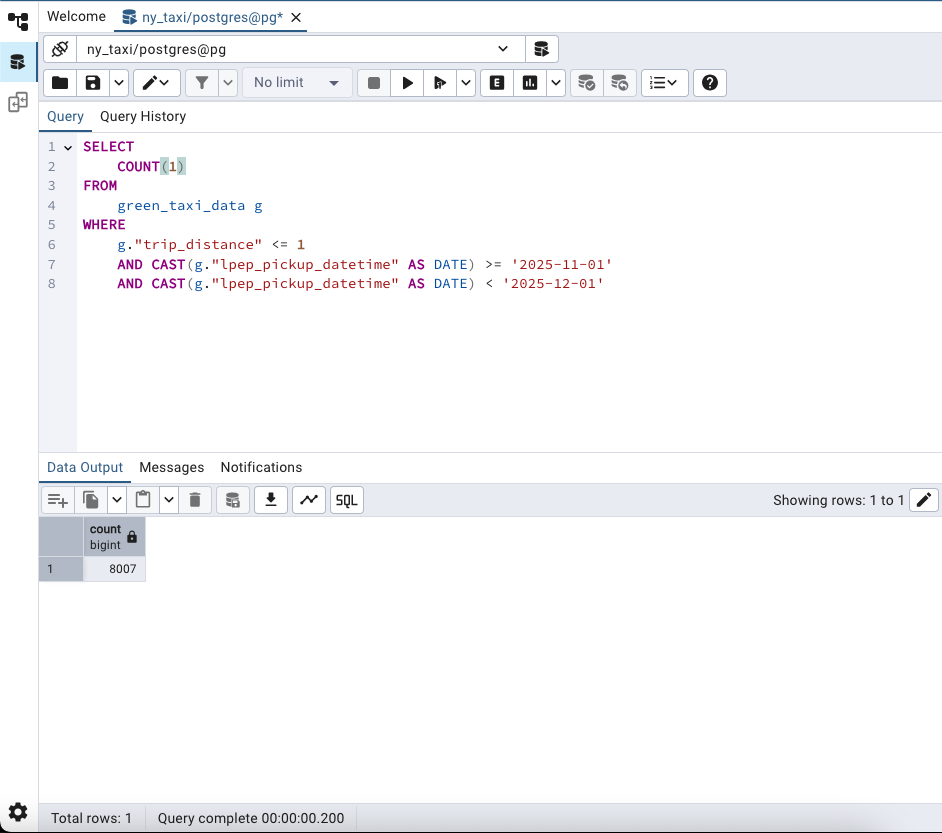
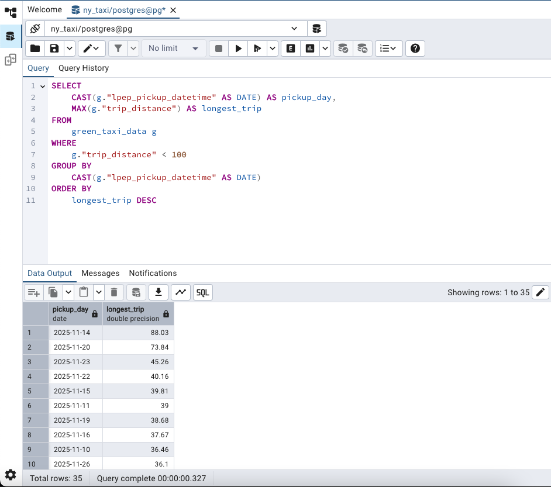
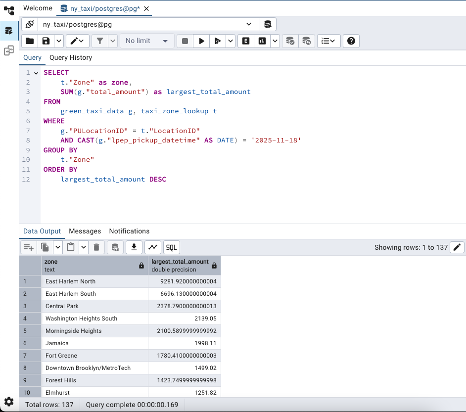
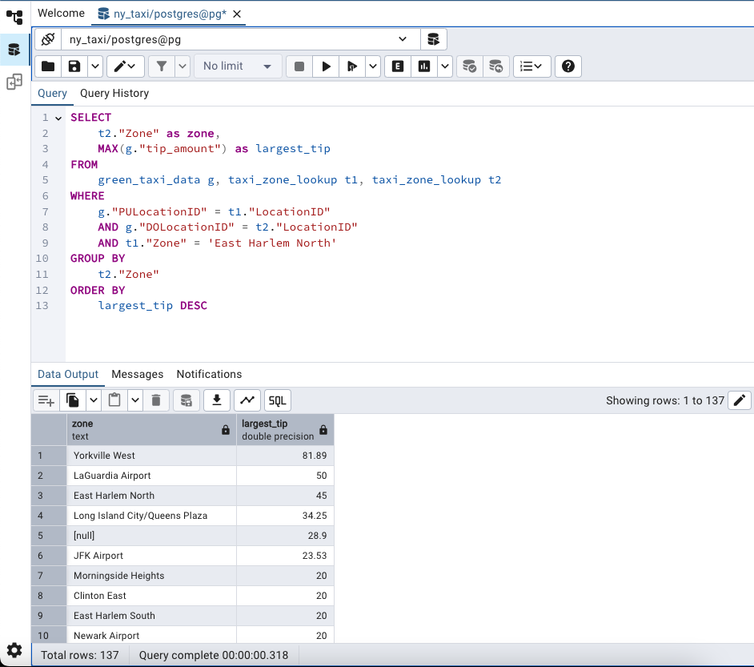

# Solutions for the Module 1 Homework: Docker & SQL

## Question 1. Understanding Docker images

Run docker with the `python:3.13` image. Use an entrypoint `bash` to interact with the container.

What's the version of `pip` in the image?

- 25.3 ✅
- 24.3.1 ❌
- 24.2.1 ❌
- 23.3.1 ❌

### Solution 

To solve this question, run the following commands:

```bash
docker run -it --entrypoint=bash python:3.13

pip --version
```



As we can see in the image above, the pip version is **25.3**.

## Question 2. Understanding Docker networking and docker-compose

Given the following `docker-compose.yaml`, what is the `hostname` and `port` that pgadmin should use to connect to the postgres database?

```yaml
services:
  db:
    container_name: postgres
    image: postgres:17-alpine
    environment:
      POSTGRES_USER: 'postgres'
      POSTGRES_PASSWORD: 'postgres'
      POSTGRES_DB: 'ny_taxi'
    ports:
      - '5433:5432'
    volumes:
      - vol-pgdata:/var/lib/postgresql/data

  pgadmin:
    container_name: pgadmin
    image: dpage/pgadmin4:latest
    environment:
      PGADMIN_DEFAULT_EMAIL: "pgadmin@pgadmin.com"
      PGADMIN_DEFAULT_PASSWORD: "pgadmin"
    ports:
      - "8080:80"
    volumes:
      - vol-pgadmin_data:/var/lib/pgadmin

volumes:
  vol-pgdata:
    name: vol-pgdata
  vol-pgadmin_data:
    name: vol-pgadmin_data
```

- postgres:5433 ❌
- localhost:5432 ❌
- db:5433 ❌
- postgres:5432 ✅
- db:5432 ✅

If multiple answers are correct, select any 

### Solution

Since the connection should be made from within the pgadmin to the postgres container, it means that this is a container-to-container connection. When using docker compose, it creates a default bridge network and each service becomes a DNS hostname. Therefore, the hostname for pgadmin to connect to postgres should be **db**. However, in this special case, the **postgres** hostname also works, because there's only one container for postgres. If it were to scale up this service, the connection using **postgres** as hostname would not work.

As for the port, since we are connecting from within pgadmin to postgres, it should address the internal port of the postgres container, which is **5432**. If we were to connect to postgres from within our local machine, then we should rely on port **5433**.

Empirically i've tested both alternatives of hostnames to see if the connection was made. The result was succesful for both as we can see in the images below.






## Setting up the environment for questions 3 to 6

To answer the following questions, the containers for postgres and pgadmin were setup using the following commands:

```bash
docker compose up -d
```

Then, on another terminal, run the ingest_data.py file to insert the green_taxi_data and taxi_zones_lookup into the postgres container.

```bash
python ingest_data.py
```

On the pgadmin webpage (localhost:8080), connect to the postgres service using the **db** hostname and port **5432**. 

## Question 3. Counting short trips

For the trips in November 2025 (lpep_pickup_datetime between '2025-11-01' and '2025-12-01', exclusive of the upper bound), how many trips had a `trip_distance` of less than or equal to 1 mile?

- 7,853 ❌
- 8,007 ✅
- 8,254 ❌
- 8,421 ❌

### Solution

Following is the SQL command used to answer the question.

```SQL
SELECT 
	COUNT(1)
FROM 
	green_taxi_data g
WHERE
	g."trip_distance" <= 1
	AND CAST(g."lpep_pickup_datetime" AS DATE) >= '2025-11-01'
	AND CAST(g."lpep_pickup_datetime" AS DATE) < '2025-12-01'
````



As we can see in the image above, the number of trips with trip_distances less than or equal to 1 mile, considering the date interval from 2025-11-01 to 2025-12-01 exclusively, is **8007**.

## Question 4. Longest trip for each day

Which was the pick up day with the longest trip distance? Only consider trips with `trip_distance` less than 100 miles (to exclude data errors).

Use the pick up time for your calculations.

- 2025-11-14 ✅
- 2025-11-20 ❌
- 2025-11-23 ❌
- 2025-11-25 ❌

### Solution

Following is the SQL command used to answer the question.

```SQL
SELECT 
	CAST(g."lpep_pickup_datetime" AS DATE) AS pickup_day,
	MAX(g."trip_distance") AS longest_trip
FROM 
	green_taxi_data g
WHERE
	g."trip_distance" < 100
GROUP BY
	CAST(g."lpep_pickup_datetime" AS DATE)
ORDER BY
	longest_trip DESC
```



As we can see in the image above, the pick up day with the longest trip distance, considering only trip_distances less than 100 miles is **2025-11-14**.

## Question 5. Biggest pickup zone

Which was the pickup zone with the largest `total_amount` (sum of all trips) on November 18th, 2025?

- East Harlem North ✅
- East Harlem South ❌
- Morningside Heights ❌
- Forest Hills ❌

### Solution

Following is the SQL command used to answer the question.

```SQL
SELECT
	t."Zone" as zone, 
	SUM(g."total_amount") as largest_total_amount
FROM 
	green_taxi_data g, taxi_zone_lookup t
WHERE
	g."PULocationID" = t."LocationID"
	AND CAST(g."lpep_pickup_datetime" AS DATE) = '2025-11-18'
GROUP BY
	t."Zone"
ORDER BY
	largest_total_amount DESC
```



As we can see the pickup zone with the largest `total_amount` on 2025-11-18 is **East Harlem North**.

## Question 6. Largest tip

For the passengers picked up in the zone named "East Harlem North" in November 2025, which was the drop off zone that had the largest tip?

Note: it's `tip` , not `trip`. We need the name of the zone, not the ID.

- JFK Airport ❌
- Yorkville West ✅
- East Harlem North ❌
- LaGuardia Airport ❌

### Solution
Following is the SQL command used to answer the question.

```SQL
SELECT
	t2."Zone" as zone,
	MAX(g."tip_amount") as largest_tip
FROM 
	green_taxi_data g, taxi_zone_lookup t1, taxi_zone_lookup t2 
WHERE
	g."PULocationID" = t1."LocationID"
	AND g."DOLocationID" = t2."LocationID"
	AND t1."Zone" = 'East Harlem North'
GROUP BY
	t2."Zone"
ORDER BY
	largest_tip DESC    
```



As we can see, the drop off zone with the largest tip, considering only passengers picked up in the "East Harlem North" zone is **Yorkville West**.

## Question 7. Terraform Workflow

Which of the following sequences, respectively, describes the workflow for:
1. Downloading the provider plugins and setting up backend,
2. Generating proposed changes and auto-executing the plan
3. Remove all resources managed by terraform`

Answers:
- terraform import, terraform apply -y, terraform destroy ❌
- teraform init, terraform plan -auto-apply, terraform rm ❌
- terraform init, terraform run -auto-approve, terraform destroy ❌
- terraform init, terraform apply -auto-approve, terraform destroy ✅
- terraform import, terraform apply -y, terraform rm ❌

### Solution
In the video entitled `DE Zoomcamp 1.3.1 - Terraform Primer`, the commands presented for the terraform workflow are as follows:

- terraform init: Downloads provider plugins
- terraform plan: Show the resources that will be created
- terraform apply: Build the infrastructure and executes what are in tf files
- terraform destroy: Remove all resources managed by terraform

The only answer that contains correctly the command that can be used is:

- terraform init, terraform apply -auto-approve, terraform destroy ✅