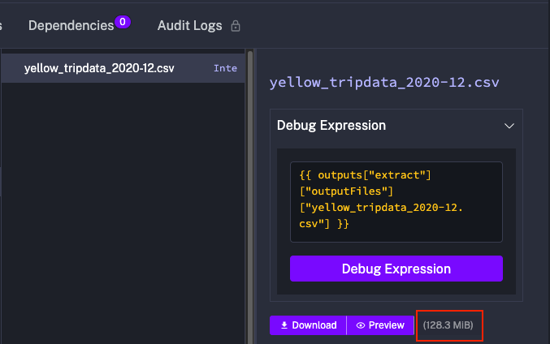
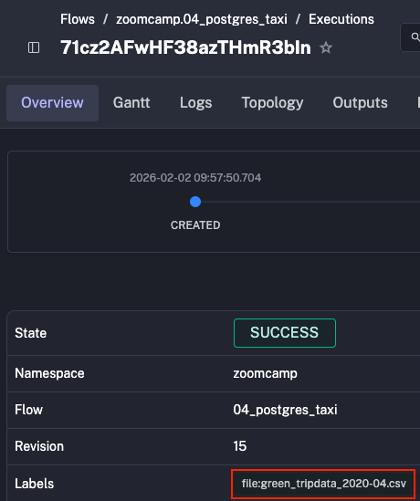
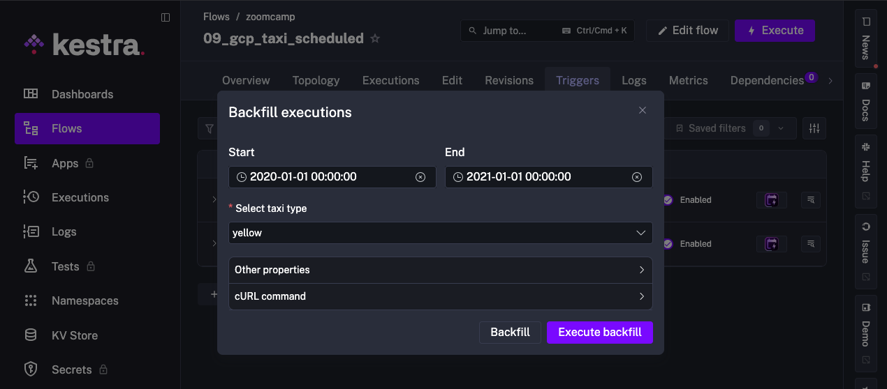
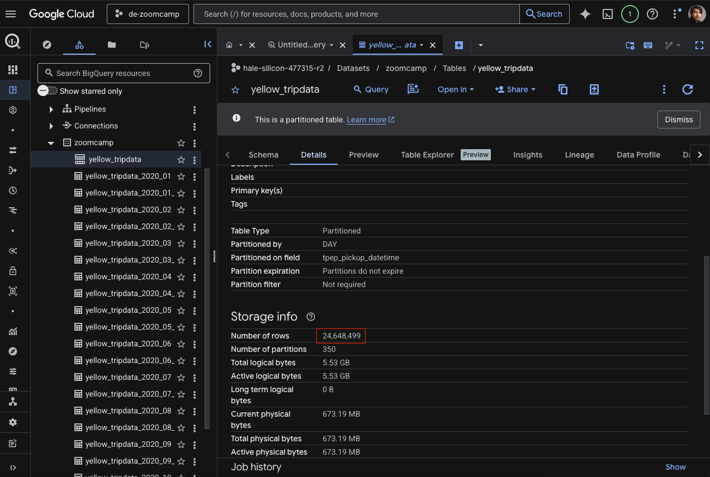
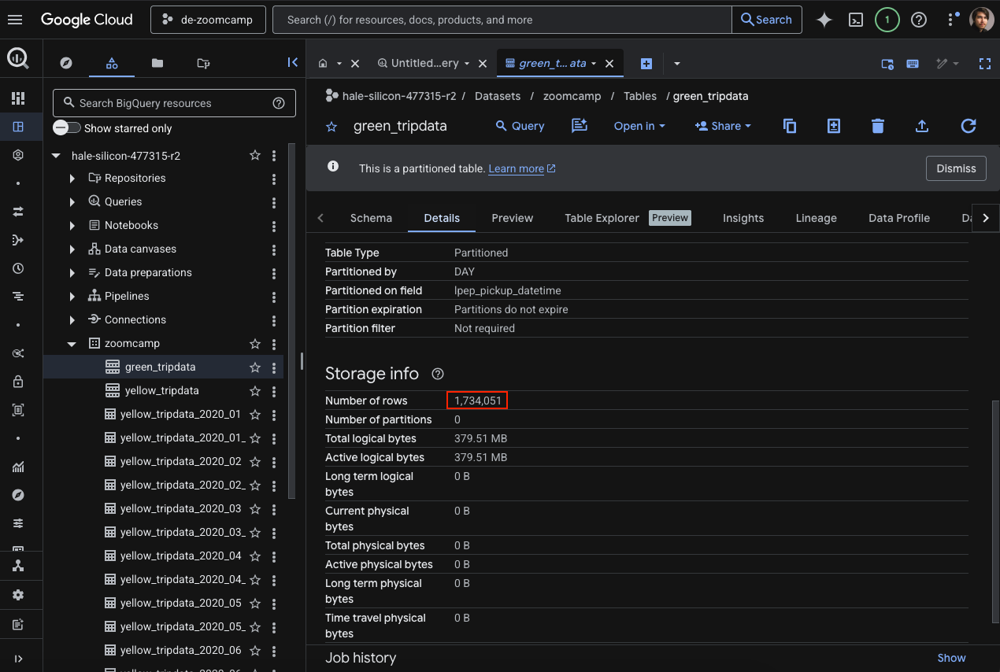
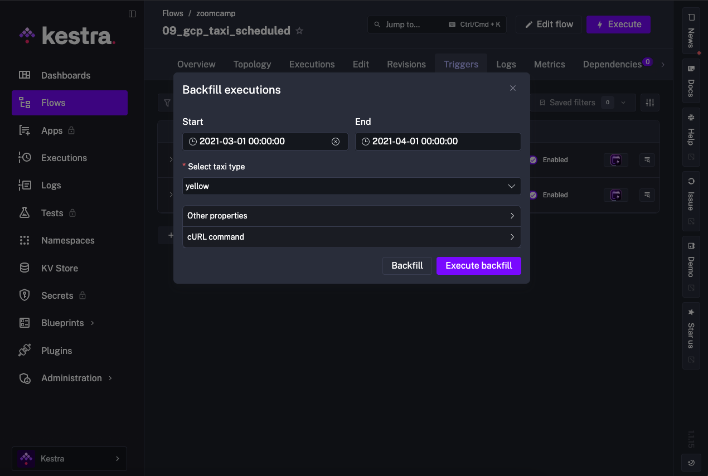
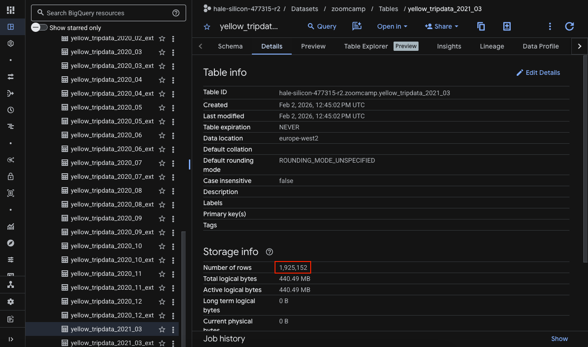
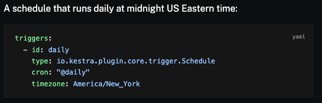

# Solutions for the Module 2 Homework: Workflow Orchestration

## Question 1

Within the execution for `Yellow` Taxi data for the year `2020` and month `12`: what is the uncompressed file size (i.e. the output file `yellow_tripdata_2020-12.csv` of the `extract` task)?
- 128.3 MiB ✅
- 134.5 MiB ❌
- 364.7 MiB ❌
- 692.6 MiB ❌

### Solution 

Run the ``04_postgres_yaxi`` flow, without the purge file task (to be able to see the outputs), and select as input, the ``yellow`` taxi type, year `2020` and month `12`. 

Then, go to the logs tab on the Kestra flow and inspect the output of the `extract` task. The result is presented in the image below.

As can be seen, the uncompressed file size is ``128.3 MiB``.

## Question 2

What is the rendered value of the variable `file` when the inputs `taxi` is set to `green`, `year` is set to `2020`, and `month` is set to `04` during execution?
- `{{inputs.taxi}}_tripdata_{{inputs.year}}-{{inputs.month}}.csv` ❌
- `green_tripdata_2020-04.csv` ✅
- `green_tripdata_04_2020.csv` ❌
- `green_tripdata_2020.csv` ❌

### Solution

Run the ``04_postgres_yaxi`` flow, and select as input, the ``green`` taxi type, year `2020` and month `04`.

Then, one way to see what is the rendered value of the variable `file` is to look at the label value `file` of the execution.

The image below presents the label value.

As can be seen, the rendered value of the variable `file` is ``green_tripdata_2020-04.csv``.

## Question 3

How many rows are there for the `Yellow` Taxi data for all CSV files in the year 2020?
- 13,537.299 ❌
- 24,648,499 ✅
- 18,324,219 ❌
- 29,430,127 ❌

### Solution
To address this question, one can use the ``09_gcp_taxi_scheduled`` to perform the ELT operation for all CSV files of `Yellow` taxi data in the year 2020, on GCS and BigQuery.

Specifically for this question, the trigger to be selected should be `yellow` and the backfill should be from ``2020-01-01 00:00:00`` to ``2021-01-01 00:00:00``, as in the image below.

After all CSVs are loaded and transformed, inspect the details of the `yellow_tripdata` table on BigQuery, just like in the image below.

As we can see, the total number of rows of yellow taxi data in the year 2020 is ``24,648,499``.

## Question 4

How many rows are there for the `Green` Taxi data for all CSV files in the year 2020?
- 5,327,301 ❌
- 936,199 ❌
- 1,734,051 ✅
- 1,342,034 ❌

### Solution

To address this question, one can use the ``09_gcp_taxi_scheduled`` to perform the ELT operation for all CSV files of `Green` taxi data in the year 2020, on GCS and BigQuery.

Specifically for this question, the trigger to be selected should be `green` and the backfill should be from ``2020-01-01 00:00:00`` to ``2021-01-01 00:00:00``, as in the image below.

After all CSVs are loaded and transformed, inspect the details of the `green_tripdata` table on BigQuery, just like in the image below.

As we can see, the total number of rows of green taxi data in the year 2020 is ``1,734,051``.

## Question 5

How many rows are there for the `Yellow` Taxi data for the March 2021 CSV file?
- 1,428,092 ❌
- 706,911 ❌
- 1,925,152 ✅
- 2,561,031 ❌

### Solution

To address this question, one can use the ``09_gcp_taxi_scheduled`` to perform the ELT operation on `Yellow` taxi data for March 2021, on GCS and BigQuery.

Specifically for this question, the trigger to be selected should be `yellow` and the backfill should be from ``2021-03-01 00:00:00`` to ``2021-04-01 00:00:00``, as in the image below.

After the CSV is loaded and transformed, inspect the details of the `yellow_tripdata_2021_03` table on BigQuery, just like in the image below.

As we can see, the total number of rows of Yellow taxi data in March 2021 is ``1,925,152``.

## Question 6

How would you configure the timezone to New York in a Schedule trigger?
- Add a `timezone` property set to `EST` in the `Schedule` trigger configuration ❌
- Add a `timezone` property set to `America/New_York` in the `Schedule` trigger configuration ✅
- Add a `timezone` property set to `UTC-5` in the `Schedule` trigger configuration ❌
- Add a `location` property set to `New_York` in the `Schedule` trigger configuration ❌

### Solution

A quick research on the documentation [1] of Kestra's schedule trigger, shows a quick example that includes a timezone to New York, as presented in the image below.

As we can see, the solution would be to add the `timezone` property and set to `America/New_York`. 

[1] https://kestra.io/docs/workflow-components/triggers/schedule-trigger

