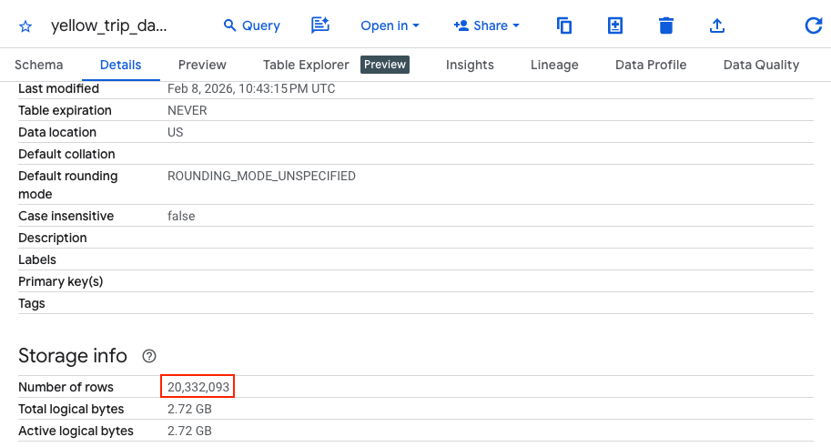
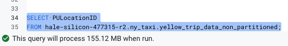
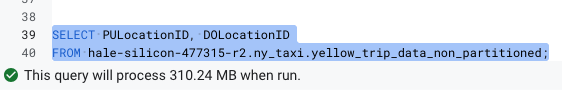
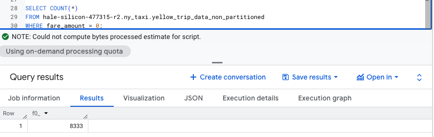
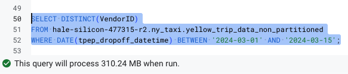
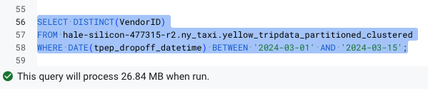

# Solutions for the Module 3 Homework: Data Warehousing & BigQuery

## Question 1

What is count of records for the 2024 Yellow Taxi Data?
- 65,623 ❌
- 840,402 ❌
- 20,332,093 ✅
- 85,431,289 ❌

### Solution

We need to load the parquet files, using the [load_yellow_taxi_data.py](https://github.com/DataTalksClub/data-engineering-zoomcamp/blob/main/cohorts/2026/03-data-warehouse/load_yellow_taxi_data.py) python script and ensuring that we replace the variables with the right values (i.e. access keys and bucket name).

After that, we can go to BigQuery and create an external table with the following SQL command:

```SQL
CREATE OR REPLACE EXTERNAL TABLE `<project_id>.<dataset_name>.external_yellow_tripdata`
OPTIONS (
  format = 'PARQUET',
  uris = ['gs://<gcs_bucket_name>/yellow_tripdata_2024-*.parquet']
);
```

Lastly, we can see the count of records by inspecting the details of the external table, as in the image below.



As we can see, the count of records for the 2024 yellow taxi data is `20,332,093`.

## Question 2

Write a query to count the distinct number of PULocationIDs for the entire dataset on both the tables.
 
What is the **estimated amount** of data that will be read when this query is executed on the External Table and the Table?

- 18.82 MB for the External Table and 47.60 MB for the Materialized Table ❌
- 0 MB for the External Table and 155.12 MB for the Materialized Table ✅
- 2.14 GB for the External Table and 0MB for the Materialized Table ❌
- 0 MB for the External Table and 0MB for the Materialized Table ❌

### Solution
For that, we need not only the previously created external table, but actually a materialized table as well. To create the materialized table, we can use the following SQL command:

```SQL
CREATE OR REPLACE TABLE <project_id>.<dataset_name>.yellow_trip_data_non_partitioned AS
SELECT * FROM <project_id>.<dataset_name>.external_yellow_tripdata;
```

The query to count the distinct number of PULocationIDs for both tables are displayed in the images below, for the external table and the materialized one, respectively.


As we can see, for the external table it estimates `0 MB`, while for the materialized one, it estimates `155.12 MB`.
## Question 3

Write a query to retrieve the PULocationID from the table (not the external table) in BigQuery. Now write a query to retrieve the PULocationID and DOLocationID on the same table.

Why are the estimated number of Bytes different?
- BigQuery is a columnar database, and it only scans the specific columns requested in the query. Querying two columns (PULocationID, DOLocationID) requires 
reading more data than querying one column (PULocationID), leading to a higher estimated number of bytes processed. ✅
- BigQuery duplicates data across multiple storage partitions, so selecting two columns instead of one requires scanning the table twice, 
doubling the estimated bytes processed. ❌
- BigQuery automatically caches the first queried column, so adding a second column increases processing time but does not affect the estimated bytes scanned. ❌
- When selecting multiple columns, BigQuery performs an implicit join operation between them, increasing the estimated bytes processed ❌

### Solution
The queries were created and the values of bytes estimated are presented in the images below.





The answer relies on the internals of BigQuery, as it is a columnar database, it estimates the bytes to be processed, based on the columns that were queried. That's one of the reasons of why it is considered a best practice to not perform a "SELECT *", as it would query all the columns and lead to higher number of bytes to be processed. 

## Question 4

How many records have a fare_amount of 0?
- 128,210 ❌
- 546,578 ❌
- 20,188,016 ❌
- 8,333 ✅

### Solution

The query to count the number of records that have fare_amount equals to 0 is presented below. 

```SQL
SELECT COUNT(*)
FROM <project_id>.<dataset_name>.yellow_trip_data_non_partitioned
WHERE fare_amount = 0
```



As we can see in the image above, the number of records presented in the result of the query is `8,333`.

## Question 5

What is the best strategy to make an optimized table in Big Query if your query will always filter based on tpep_dropoff_datetime and order the results by VendorID (Create a new table with this strategy)

- Partition by tpep_dropoff_datetime and Cluster on VendorID ✅
- Cluster on by tpep_dropoff_datetime and Cluster on VendorID ❌
- Cluster on tpep_dropoff_datetime Partition by VendorID ❌
- Partition by tpep_dropoff_datetime and Partition by VendorID ❌

### Solution
To filter based on tpep_dropoff_datetime, it is better to use `Partition`, because it is a DATE column type, and also most of the queries would benefit from filtering on some particular dates.

As for ordering the VendorID column, its better to use `Cluster`, to benefit from fact that we most likely would use aggregate functions on top of the clustered column. 

The table can be created using the following SQL command.

```SQL
CREATE OR REPLACE TABLE <project_id>.<dataset_name>.yellow_tripdata_partitioned_clustered
PARTITION BY DATE(tpep_dropoff_datetime)
CLUSTER BY VendorID AS
SELECT * FROM <project_id>.<dataset_name>.external_yellow_tripdata;
```

## Question 6

Write a query to retrieve the distinct VendorIDs between tpep_dropoff_datetime
2024-03-01 and 2024-03-15 (inclusive)


Use the materialized table you created earlier in your from clause and note the estimated bytes. Now change the table in the from clause to the partitioned table you created for question 5 and note the estimated bytes processed. What are these values? 


Choose the answer which most closely matches.
 

- 12.47 MB for non-partitioned table and 326.42 MB for the partitioned table ❌
- 310.24 MB for non-partitioned table and 26.84 MB for the partitioned table ✅
- 5.87 MB for non-partitioned table and 0 MB for the partitioned table ❌
- 310.31 MB for non-partitioned table and 285.64 MB for the partitioned table ❌

### Solution

The SQL query to retrieve the distinct VendorIDs between tpep_dropoff_datetime
2024-03-01 and 2024-03-15 (inclusive) is presented below.

```SQL
SELECT DISTINCT(VendorID)
FROM <project_id>.<dataset_name>.yellow_trip_data_non_partitioned
WHERE DATE(tpep_dropoff_datetime) BETWEEN '2024-03-01' AND '2024-03-15'
````

The estimated bytes processed are presented in the images below, for the non-partitioned and partitioned table, respectively.





As can be seen, for the non-partitioned table it estimates `310.24 MB`, while for the partitioned table is estimated `26.84 MB` to be processed.

## Question 7

Where is the data stored in the External Table you created?

- Big Query ❌
- Container Registry ❌
- GCP Bucket ✅
- Big Table ❌

### Solution

When using external table, the data is not stored on BigQuery, but rather it uses the storage system that it is connected to. In this case, the data was storage on Google Cloud Storage, more specifically, the `GCP bucket`.

## Question 8

It is best practice in Big Query to always cluster your data:
- True ❌
- False ✅

### Solution

No. While clustering the data in certain conditions can help reduce bytes to processed and hence the costs, there are cases where it could actually cause to increase the complexity and computing needed to process queries. This happens, for instance, when the table is too small or when the queries are performed over every columns.

## Question 9

Write a `SELECT count(*)` query FROM the materialized table you created. How many bytes does it estimate will be read? Why?

### Solution
It estimates 0 bytes. That's because when creating a materialized table, the information about the number of rows is computed and stored as metadata and BigQuery only has to resort on that, whenever we perform a `COUNT(*)`, instead of computing it again.