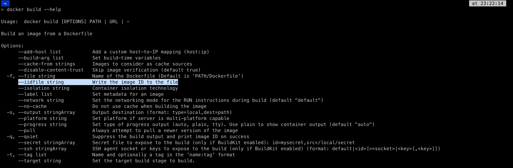
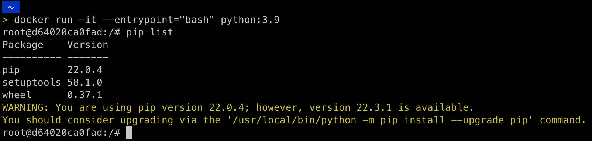
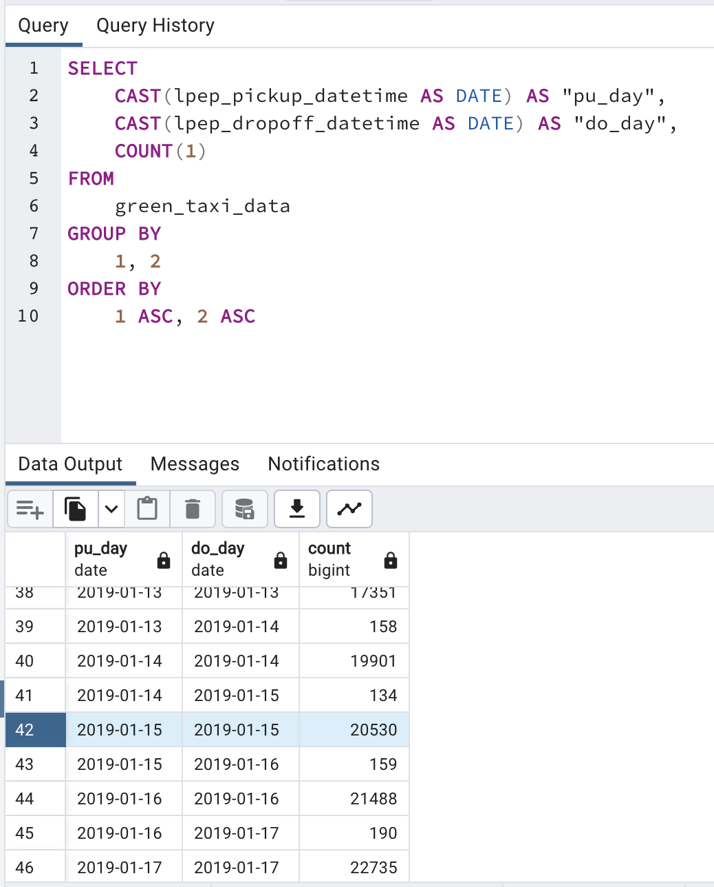
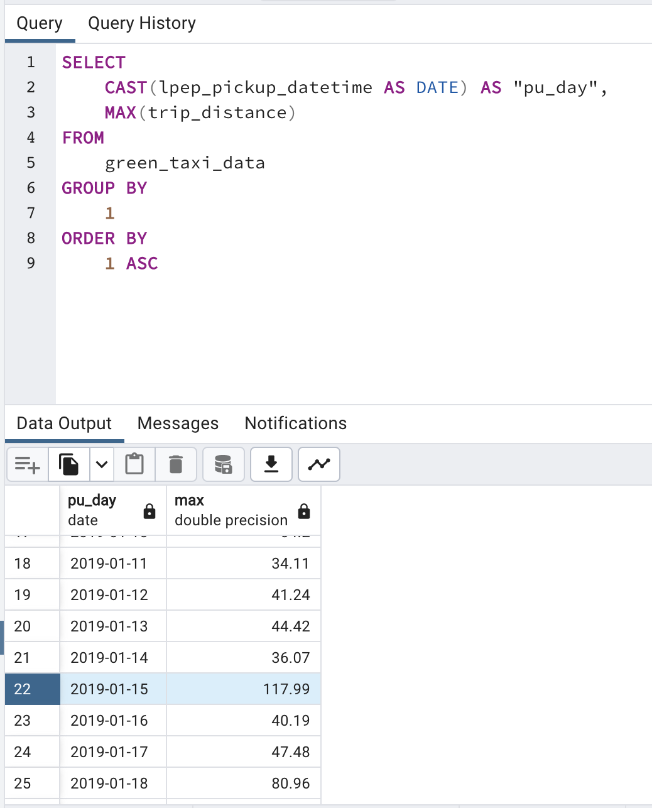
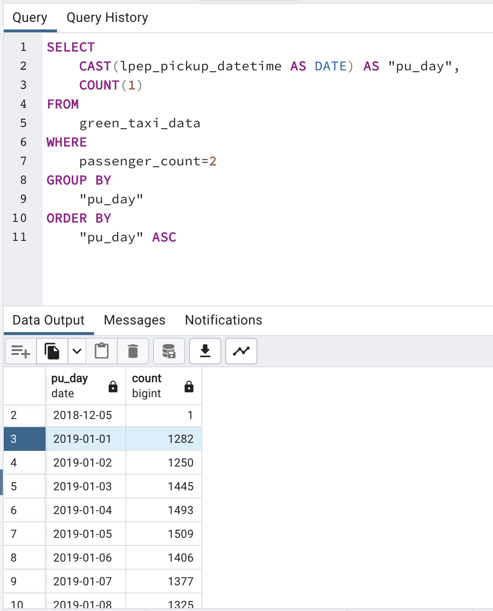
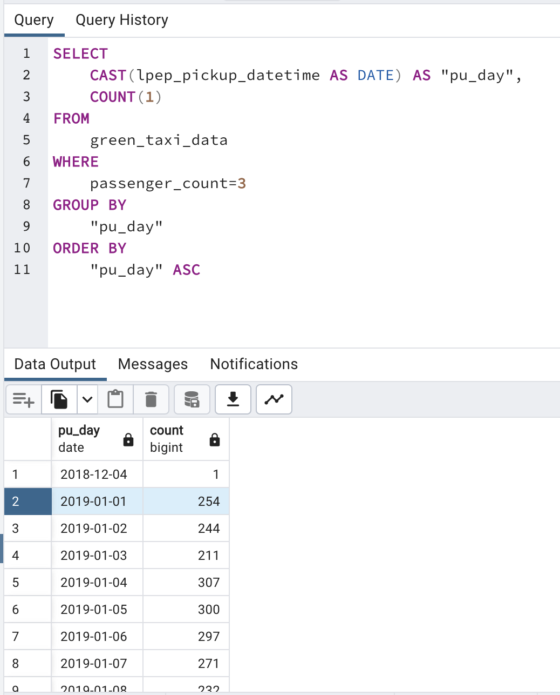
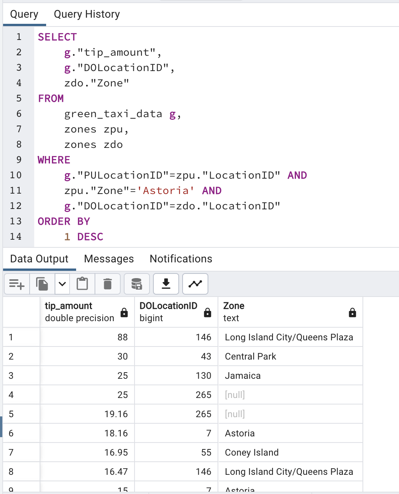

## Week 1 Homework Solutions

This file contains the submitted solutions for the week 1 homework of Data Engineering Zoomcamp.

## Answer 1. Knowing docker tags

Print of the output of the ```docker build --help``` command.



The answer is ```--iidfile string```.

### Answer 2. Understanding docker first run

Print of the output, after running ```pip list``` inside the python:3.9 docker container.



The answer is **3**.

### Answer 3. Count records



The answer is **20530**

### Question 4. Largest trip for each day



The answer is **2019-01-15**

### Question 5. The number of passengers

Number of trips with exactly two passengers



Number of trips with exactly three passengers



Therefore, the answer is **2: 1282 ; 3: 254**

### Question 6. Largest tip



The answer is **Long Island City/Queens Plaza**