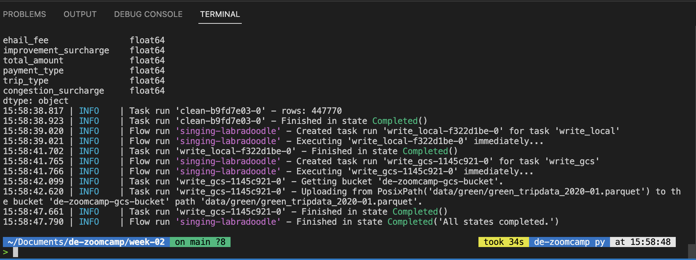
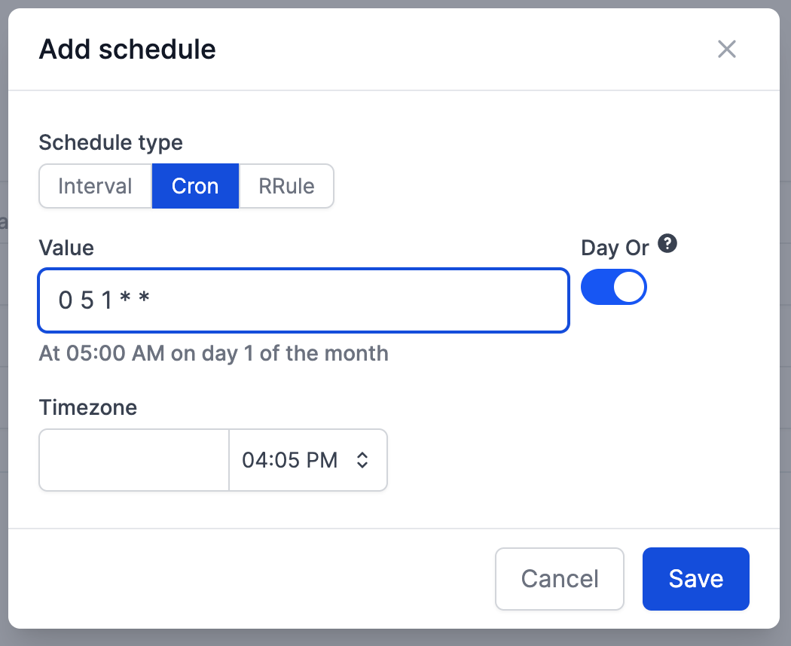

## Week 2 Homework Solutions

This file contains the submitted solutions for the week 2 homework of Data Engineering Zoomcamp.

## Answer 1. Load January 2020 data

Run the etl_web_to_gcs.py script and observe the logs output. 

*Note: The green taxi dataframe has different columns, so we have to comment out the lines of datetime conversion of pickup and dropoff.*

The answer is **447770**.

## Answer 2. Scheduling with Cron

Go to the deployment page of the Orion server and setup the scheduler on the cron tab. Then, try the option that matches the desired scheduling pattern (first day of the month at 5 AM).

The answer is **0 5 1 \* \***.

## Answer 3. Loading data to BigQuery 

